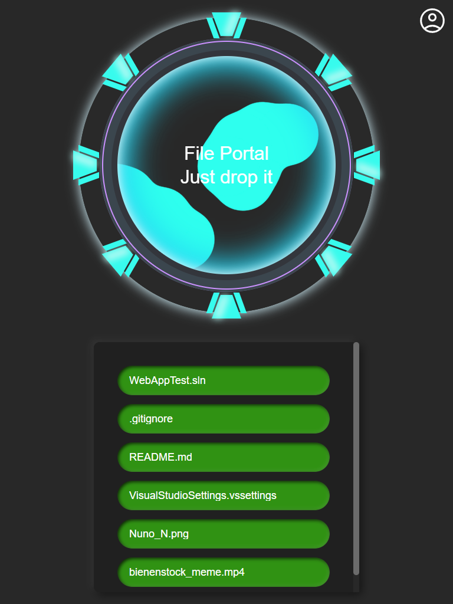

# FileDrop

<p>
  <a href="https://drone.nussmueller.dev/Borelio/FileDrop">
    
  </a>
  
</p>

A self-hosted mailbox that can receive all kind of files. 
It's like a portal that sends all files to you that get dropped into it.

<div>
    
    
</div>

## ❓ Why?

I realy don't know. I just wanted to build something like this.

## 🔧 How to Install

### 🐳 Docker

```bash
git clone https://github.com/Borelio/FileDrop.git
cd Deployment

docker compose up -d
```

Browse to http://localhost:3091/ after starting.

### 💪🏻 Non-Docker

🛑 Just don't
